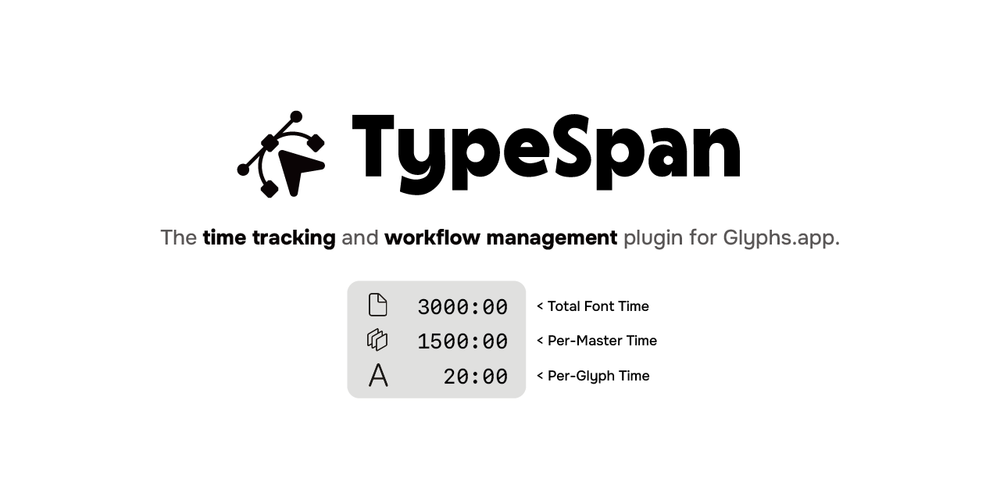
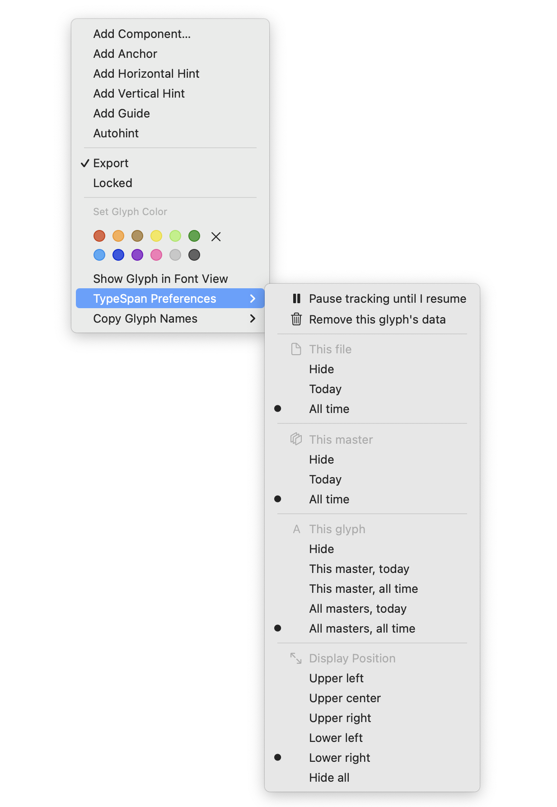
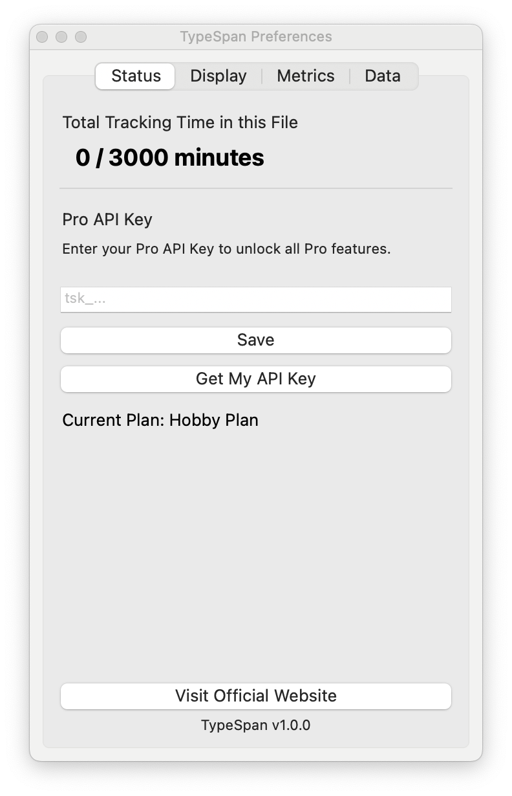
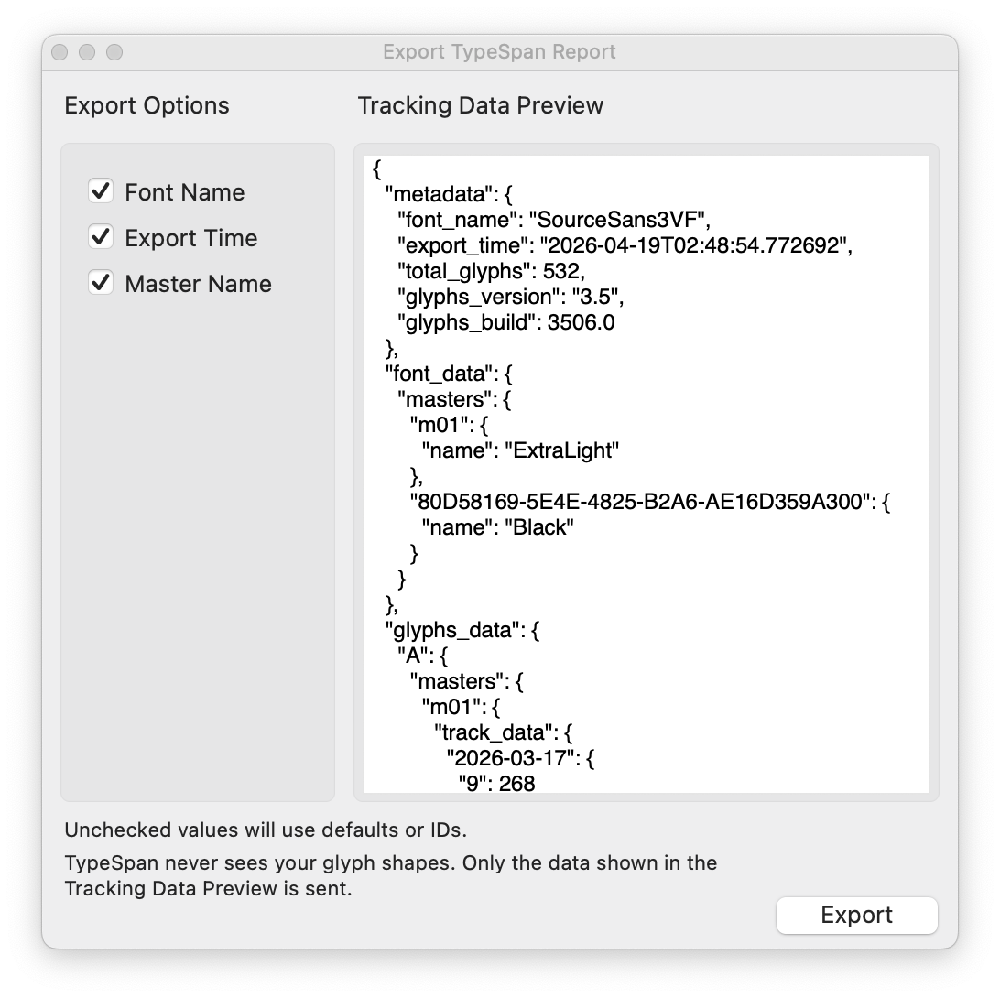

# TypeSpan

▶ [TypeSpan Official Website](https://typespan.com) ◀

The time tracking and workflow management plugin for [Glyphs.app](https://glyphsapp.com/).

TypeSpan runs quietly in the background while you design. It records how long you spend on each glyph and master, helping you understand your workflow, estimate project timelines, and share progress with clients or teammates.

## Requirements

- macOS
- Glyphs 3 or later
- Python 3 and [Vanilla](https://vanilla.robotools.dev/) installed via the Glyphs Plugin Manager

## Installation

**Via Plugin Manager (recommended)**

1. Open Glyphs.app and go to **Window > Plugin Manager**
2. In the **Modules** tab, install **Python** and **Vanilla**
3. In the **Plugins** tab, search for **TypeSpan** and click **Install**
4. Restart Glyphs.app

**Manual**

1. In the **Modules** tab of Plugin Manager, install **Python** and **Vanilla**
2. Download `TypeSpan.glyphsReporter` from this repository
3. Double-click the file — Glyphs.app will install it automatically
4. Restart Glyphs.app

## Getting Started

1. After restarting, go to **View > Show TypeSpan** to activate the plugin
2. Open any glyph in Edit view. TypeSpan starts tracking automatically. No manual timers needed.
3. When you switch to another app, tracking pauses. When you return, it resumes seamlessly.
4. All tracking data is stored locally inside your Glyphs font files. Nothing leaves your machine until you choose to export.

## Preferences

1. Right-click anywhere in Edit view and select **TypeSpan Preferences** from the context menu

2. For the full settings panel, go to **Window > TypeSpan Preferences**

## Exporting Reports

TypeSpan can generate web-based reports showing time spent per glyph, per master, and across your entire project.

1. Go to **File > Export TypeSpan Report...**
2. Review the data you'd like to include and click **Export**
3. Your report will be uploaded and a shareable link will be generated

TypeSpan only collects time-tracking data and the minimal font metadata you explicitly permit. It never accesses or transmits your glyph outline data.

## Plans

### Hobby Plan

All core time-tracking features included. Track up to 3,000 minutes per font file. For personal, non-commercial projects only.

### Pro Plan

Unlimited tracking, permanent shareable report links, and full report history. Required for commercial work and studio or team use.

Visit [TypeSpan](https://typespan.com/billing) for full plan details and pricing.

## Support

- Guide: [TypeSpan/Guide](https://typespan.com/guide)
- FAQ: [TypeSpan/Frequently Asked Questions](https://typespan.com/faq)
- Contact: [hello@typespan.com](mailto:hello@typespan.com)

## License

Copyright (c) 2026 TypeSpan. All rights reserved.
